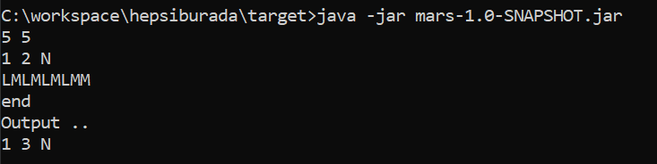

### README

##Description
<strong> Mars Rover Case solution with implemented Java.</strong>

<strong>Running </strong> 
* You can run executable jar to test application like below. 
* To end rover input and to see output, write "end" to console. 

 
* Note : The 3rd and 4th lines of the inputs in the PDF looks like incorrect.
  The "M" command, which should be at the end of the 3rd line, is assumed to be accidentally shifted to the bottom line.